# Hi 👋, I'm Edward Lo

### A passionate developer

  

<h3 align="left">Connect with me:</h3>

<h3 align="left">Languages and Tools:</h3>

                                            

| Stats | Top Languages |
|-------|---------------|
|  |  | 

